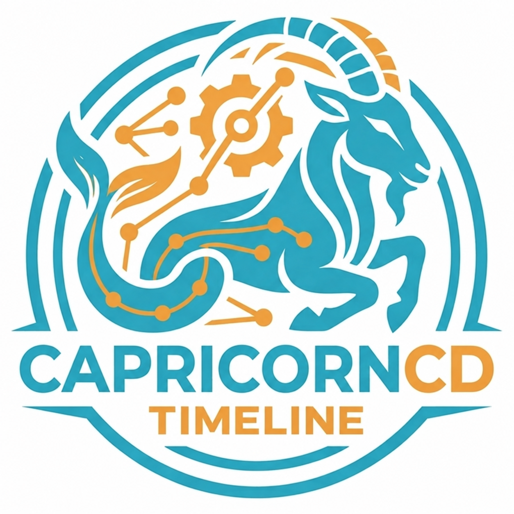

# ComfyUI-Capricorncd-Timeline

[English](README.md) · [编辑器完整指南](docs/zh/timeline-editor.md) · [示例工作流](workflows/) · [更新记录](CHANGELOG.md)

<p align="center">
  
</p>

面向 [ComfyUI](https://github.com/comfyanonymous/ComfyUI) 的可视化时间轴编辑器。在同一个界面编排镜头、管理提示词、通过已连接的工作流生成片段，再剪辑并合成视频。


## 从镜头编排到视频交付

- **编排镜头：** 使用导演、媒体、音频和字幕轨道，为 Clip 配置参考图片、首尾帧及视频。
- **只重做需要修改的片段：** 运行单个 Clip，或运行同轨左侧/右侧未禁用的 Clip；保留历次生成结果，按需选择。
- **管理提示词：** 编辑 Clip 提示词和全局前置、后置提示词，选择提供给模型的参考内容，使用已配置 Agent 或本地 VL 模型优化当前 Clip 提示词。
- **先预览再生成：** 接入预览工作流，调整种子，并可播放当前 Clip 区间的时间轴音频。
- **剪辑与排版：** 裁剪、分割、框选整体移动、相邻 Clip 交换及撤销/重做；媒体支持透明度、缩放与位置，字幕支持字体、描边、投影和位置设置。
- **调整声音：** 在波形上编辑音量控制点。未禁用、未静音的生成视频原声与独立音频，在预览和导出时一起混合播放。
- **交付与复用：** 合成 MP4，或将工程、素材和当前工作流一起导出为目录或 ZIP。

## 快速开始

1. 安装插件，打开[示例工作流](workflows/)。
2. 打开 **时间轴编辑器**，导入素材，设置项目尺寸与帧率，编排各个 Clip。
3. 为 Clip 添加参考素材与提示词，连接相应模型的生成工作流，运行需要生成的片段。
4. 查看关联的生成视频，修剪片段、静音不需要的声音，并添加媒体叠层或字幕。
5. 通过 **导出 → 合成视频** 输出成片，或导出工程包继续编辑。

生成视频需要安装所选工作流使用的模型和节点；编辑器负责组织流程，不附带模型权重。

## 合成与导出

合成窗口默认使用 **项目设置尺寸** 和 **最高画质（H.264 CRF 16）**。CRF 16 是高画质有损编码，并非无损。

- 可选 720P、1080P、2K（1440P），以短边为目标，按项目宽高比等比缩放。
- 还可选择高画质（CRF 18）、标准（CRF 23）和优先直接拼接。只有连续片段的尺寸、编码及切点兼容时才免重编码；不满足条件时改用 CRF 18 精确合成，并在结果中提示。
- 是否合成声音统一由时间轴上的静音、启用状态决定，导出窗口不再另设音频排除开关。
- “水印”标题前的复选框控制文字/图片水印是否使用，关闭后保留设置；字体列表首项为“系统字体”。
- 工程包包含 `project.json`、`workflow.json` 和 `media/`，不包含模型及插件。换机器后先加载工作流，再从编辑器导入工程包，以重新定位素材。

完整操作、快捷键、提示词和工程字段说明见[编辑器指南](docs/zh/timeline-editor.md)。

## 安装

```bash
cd ComfyUI/custom_nodes
git clone https://github.com/capricorncd/ComfyUI-Capricorncd-Timeline
```

重启 ComfyUI 并刷新浏览器。合成视频需要系统 `PATH` 中有 **ffmpeg 与 ffprobe**；模型工作流和可选 Agent/VL 功能可能需要额外模型、节点或配置。

界面跟随 ComfyUI 的语言设置，支持 **English / 简体中文 / 日本語**。

## 其他节点

提示词、图像、音视频及文件工具统一保留在[节点文档索引](docs/zh/nodes.md)，主页不再逐项展开。

## 许可证

[MIT](LICENSE)
