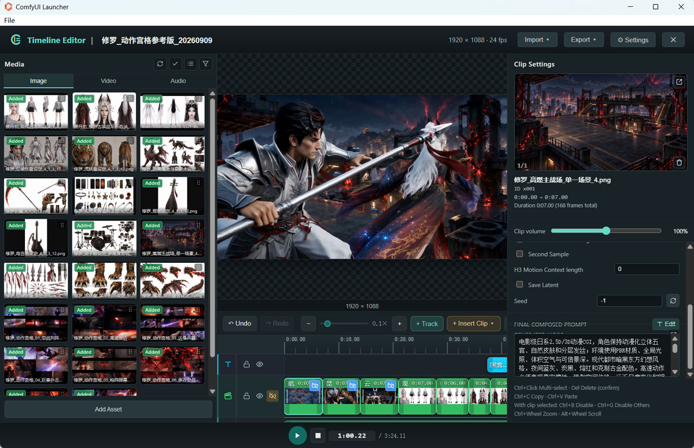
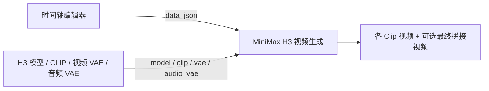

# ComfyUI-Capricorncd-Timeline

[English](README.md) · [全部节点](docs/zh/nodes.md) · [编辑器完整指南](docs/zh/timeline-editor.md) · [示例工作流](workflows/) · [更新记录](CHANGELOG.md)

<p align="center">
  
</p>

面向 [ComfyUI](https://github.com/comfyanonymous/ComfyUI) 的**长视频创作时间轴编辑器**，尤其适合 **MV、短剧与多镜头叙事视频**。将提示词、参考素材、各镜头的生成结果、音频与字幕统一放在一个工程中管理，串联镜头编排、分段生成、局部修改与最终合成。

把完整作品拆成可逐段制作的 Clip，通过已连接的工作流生成并检查各个镜头。需要调整时，只重做指定片段，保留其余结果和时间轴编排，再直接在 ComfyUI 中剪辑、合成并导出完整视频。

可以配合 [local-ai-service](https://github.com/capricorncd/local-ai-service) 使用。



## 适合 MV、短剧等长视频创作

- **MV：** 围绕音乐编排镜头，按歌曲节奏调整切点与片段时长，将生成画面、歌词或字幕和音频合成为完整作品。
- **短剧：** 按剧情组织连续镜头，将角色、场景参考素材与各 Clip 的提示词一起管理；逐段选择或重做生成结果，保留场景顺序和其他已完成片段。
- **持续制作的长视频工程：** 在同一时间轴中管理生成与剪辑进度，将工程、素材和工作流打包保存，便于后续继续制作或复用到新作品。

长视频由多个生成片段组织合成；单段可生成的时长与能力取决于所选模型和工作流。

## 从镜头编排到视频交付

- **编排镜头：** 使用导演、媒体、音频和字幕轨道，为 Clip 配置参考图片、首尾帧及视频。
- **只重做需要修改的片段：** 运行单个 Clip，或运行同轨左侧/右侧未禁用的 Clip；保留历次生成结果，按需选择。
- **管理提示词：** 编辑 Clip 提示词和全局前置、后置提示词，选择提供给模型的参考内容，使用已配置 Agent 或本地 VL 模型优化当前 Clip 提示词。
- **先预览再生成：** 接入预览工作流，调整种子，并可播放当前 Clip 区间的时间轴音频。
- **剪辑与排版：** 裁剪、分割、框选整体移动、相邻 Clip 交换及撤销/重做；媒体支持透明度、缩放与位置，字幕支持字体、描边、投影和位置设置。
- **调整声音：** 在波形上编辑音量控制点。未禁用、未静音的生成视频原声与独立音频，在预览和导出时一起混合播放。
- **交付与复用：** 合成 MP4，或将工程、素材和当前工作流一起导出为目录或 ZIP。

## 安装

```bash
cd ComfyUI/custom_nodes
git clone https://github.com/capricorncd/ComfyUI-Capricorncd-Timeline
```

重启 ComfyUI 并刷新浏览器。合成视频需要系统 `PATH` 中有 **ffmpeg 与 ffprobe**；模型工作流和可选 Agent/VL 功能可能需要额外模型、节点或配置。

界面跟随 ComfyUI 的语言设置，支持 **English / 简体中文 / 日本語**。

## 快速开始

1. 完成安装后，打开[示例工作流](workflows/)。
2. 打开 **时间轴编辑器**，导入参考素材及所需音乐、音频，设置项目尺寸与帧率，按歌曲或剧情编排各个 Clip。
3. 为 Clip 添加参考素材与提示词，连接相应模型的生成工作流，运行需要生成的片段。
4. 查看关联的生成视频，修剪片段、静音不需要的声音，并添加媒体叠层或字幕。
5. 通过 **导出 → 合成视频** 输出成片，或导出工程包继续编辑。

生成视频需要安装所选工作流使用的模型和节点；编辑器负责组织流程，不附带模型权重。

## 两个核心节点：编辑时间轴，连接后生成

| 节点 | 用途 | 详细说明 |
|---|---|---|
| **时间轴编辑器（Timeline Editor）** | 编排 Clip、提示词、参考素材和音频，选择需要运行的片段。 | [编辑器指南](docs/zh/timeline-editor.md) |
| **MiniMax H3 视频生成（MiniMax H3 Video Generator）** | 读取时间轴，逐个 Clip 采样并保存视频，可自动拼接生成结果。 | [H3 生成指南](docs/zh/h3-video-generator.md) |

两个节点的 **`data_json`** 连接后即可配合使用；再将 H3 模型、CLIP、视频 VAE 和音频 VAE 接到生成节点的对应输入，从时间轴运行：


```mermaid
flowchart LR
    T["时间轴编辑器"] -->|data_json| H["MiniMax H3 视频生成"]
    M["H3 模型 / CLIP / 视频 VAE / 音频 VAE"] -->|model / clip / vae / audio_vae| H
    H --> V["各 Clip 视频 + 可选最终拼接视频"]
```

1. 项目宽、高设为 **32 的正整数倍**，例如 1344 × 768；添加导演 Clip，填写提示词、绑定素材并选择 Clip 类型。
2. 连接 `Timeline Editor.data_json → MiniMax H3 Video Generator.data_json`，选择匹配的模型和生成参数。二采需要 Latent 放大模型，动态采样预览需要 KJNodes；参见[依赖说明](docs/zh/h3-video-generator.md#按功能需要的依赖)，也可关闭这两项，使用无采样预览的单采流程。
3. 在编辑器中运行单个 Clip 或指定的一组 Clip。生成节点完成采样、解码和保存，这条流程无需另外接片段解析、采样器或序列帧保存节点。
4. “合成最终视频”默认开启，只有一个输出时直接复用；`video_files`、`composed_video` 输出文件路径。需要包含背景音乐、字幕和媒体叠层的完整成片时，使用编辑器的 **导出 → 合成视频**。

### 按需添加的节点

以下节点按需要接入 **MiniMax H3 视频生成**：

| 扩展 | 连接与使用 |
|---|---|
| [H3 自动提示词配置](docs/zh/h3-shared-prompt.md) | `auto_prompt_config → auto_prompt_config`；在目标 Clip 中开启“自动生成提示词”。共用生成节点的 CLIP，在配置中选择兼容的 generation tail。 |
| [H3 音频修复配置](docs/zh/h3-video-generator.md#音频修复配置) / [H3 人脸修复配置](docs/zh/h3-face-refine.md) | 分别连接 `audio_refine_config` / `face_refine_config`，在配置节点启用所需修复。 |
| [H3 插帧配置](docs/zh/h3-video-generator.md#rife-插帧) / [H3 SelfLift 配置](docs/zh/h3-video-generator.md#selflift-渐进采样实验) | 分别连接 `interpolation_config` / `selflift_config`，安装各自文档要求的依赖。 |
| [Show Anything](docs/zh/show-anything.md) | 接入 `generated_prompts`，查看实际用于采样的提示词。 |

自定义模型流程可用[片段数据解析](docs/zh/data-json-clip-parser.md)提取单个 Clip，将提示词、图片和帧数接入模型，再将解码图像与可选音频交给[序列帧合成视频](docs/zh/seq-to-video.md)。自行搭建 H3 采样时，可用 [MiniMaxH3](docs/zh/minimax-h3.md) 提供条件和 latent。[多段视频合成](docs/zh/compose-clip-videos.md)读取包含已保存视频路径的 `data_json`；核心 H3 生成节点开启最终合成后已包含这一步。

全部节点及分类层级、连接关系见[完整节点索引](docs/zh/nodes.md)。

## 合成与导出

合成窗口默认使用 **项目设置尺寸** 和 **最高画质（H.264 CRF 16）**。CRF 16 是高画质有损编码，并非无损。

- 可选 720P、1080P、2K（1440P），以短边为目标，按项目宽高比等比缩放。
- 还可选择高画质（CRF 18）、标准（CRF 23）和优先直接拼接。只有连续片段的尺寸、编码及切点兼容时才免重编码；不满足条件时改用 CRF 18 精确合成，并在结果中提示。
- 是否合成声音统一由时间轴上的静音、启用状态决定，导出窗口不再另设音频排除开关。
- “水印”标题前的复选框控制文字/图片水印是否使用，关闭后保留设置；字体列表首项为“系统字体”。
- 工程包包含 `project.json`、`workflow.json` 和 `media/`，不包含模型及插件。换机器后先加载工作流，再从编辑器导入工程包，以重新定位素材。

完整操作、快捷键、提示词和工程字段说明见[编辑器指南](docs/zh/timeline-editor.md)。

## 进阶功能与服务配置

### 角色音色（绑定与配置）

在素材预览的基本信息中绑定、更换或解绑一条参考音频，并可直接试听。音频轨与「视频修剪」中的片段右键提供「更换音色」，可选择已绑定参考音频的素材，进入 **设置 → 音色转换** 配置服务。目前完成绑定与配置，尚未发送转换请求或替换音频；服务需对接[请求／响应 v1 约定](docs/voice-conversion-api.md)。

### 字幕配音（需配置服务）

单选或多选字幕 Clip，右键「绑定角色」「转换成音频」，逐条确认角色、试听参考音频并编辑配音提示词。在 **设置 → 字幕配音** 配置自行搭建的同步服务；请求携带字幕内容及时间轴起止时刻，返回音频自动对齐字幕起点，不拉伸、不覆盖已有片段。详见[字幕配音接口约定](docs/subtitle-speech-api.md)。

### 生成视频记录与种子复用

点击生成视频文件名，在预览信息中查看已记录的 Clip ID、seed、模型与采样参数；点击 seed 旁的 **设为 Clip 种子** 可复用该值（不会自动运行）。`Seq To Video` 自动记录可确认的采样参数；连线提供的实际种子请同时接入保存节点的 `seed` 输入，例如 `MiniMaxH3.seed → Seq To Video.seed`。`Compose Clip Videos` 保留各源片段的生成记录。记录嵌入 MP4，开启同名 JSON 时同步保存；旧视频缺失的记录不从当前设置推测。

## Launcher 中保存项目

使用支持目录桥接的 ComfyUI Launcher 时，「导入 → 从目录导入」会记住项目目录。定时自动保存和关闭编辑器会更新 `project.json.bak`、`storyboard.json.bak`；Ctrl+S 或时间轴「更多 → 保存项目」更新正式的 `project.json`、`storyboard.json` 和当前工作流 `workflow.json`。「更多 → 打开项目目录」可打开该文件夹。

首次将新项目导出为目录后，会关联导出的目录；导出已有项目不改变原保存位置。导出完成后，导出按钮变为「打开文件夹」。ZIP 导入和新建项目会清除之前的目录关联。普通浏览器也支持按项目目录保存，launcher 仅额外提供系统目录选择器。

合成视频、单个 Clip 视频及音频导出支持选择其他目录，留空时使用默认 output；选定目录后文件直接保存到该目录。项目、视频和音频导出共用上次成功导出的目录，重启后保留。取消或失败不更新记录。导出目录偏好仅保存在本机浏览器存储中。项目关联目录以 `project_directory` 写入磁盘 `project.json`、备份及 workflow 的项目数据，不写入 storyboard JSON；分享项目或工作流时需注意其中包含本机路径。

项目设置中的「项目所在目录」显示当前关联目录，旧工程未关联时留空。launcher 中可选择目录，普通浏览器可手动输入本机绝对路径，验证成功后关联当前工程，不重新导入内容；已有 `project.json` 时需确认后续保存覆盖。关联后 Ctrl+S 保存正式项目，自动保存写入备份。

Ctrl+S 相当于导出到当前关联目录，不新建时间戳子目录。素材沿用工程包的 `media/images/`、`media/videos/`、`media/audios/` 和 `media/generated/` 分类，保留文件名并按原始字节复制；同名不同内容时另存，不覆盖正式项目引用的素材。旧 `media/launcher/` 文件仍可导入且不会被自动删除。自动保存不更新正式 `workflow.json`。恢复备份时应同时恢复两个 `.bak` 文件。工作流重载并打开编辑器时会恢复已保存的项目目录关联，并在已有项目文件时确认覆盖。清空项目目录会停止磁盘保存。更新此功能后需重新编译并启动 launcher，并重启 ComfyUI。

## 源码结构

`backend/` 存放 Python 节点及 API，`js/` 存放编辑器前端，`js/editor/` 存放已拆分的面板与状态模块。根目录 `__init__.py` 是 ComfyUI 加载入口；`tests/`、`scripts/` 和 `vendor/` 分别存放测试、文档脚本和内置资源。

## 许可证

[Apache-2.0](LICENSE)
