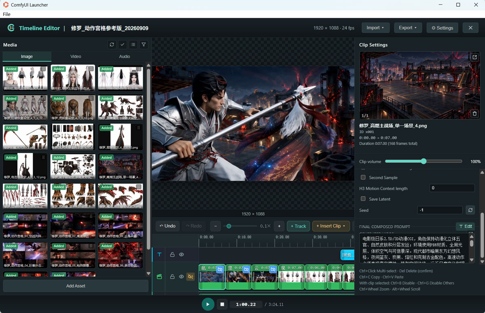

# Timeline Editor

**Category:** `Capricorncd`

The extension's main editor for **one-click video creation**, **targeted clip editing**, **separate project management**, and **project and asset import/export** in ComfyUI. Use a connected generation workflow to create a complete video, then adjust and regenerate individual clips while keeping the other results. Arrange images, videos, and audio on a fullscreen multi-track timeline, set image keyframes and per-clip prompts, regenerate selected segments through your workflow, then preview and compose generated videos with audio.

Timeline Editor stores a **track-nested `project_json`** and emits a compact runtime `data_json` with per-clip audio slices.

Open the editor from the node launcher (fullscreen shell). Edits sync back into the node's `project_json` widget.



---


## Editor UI

### Media library (left)

- Tabs: **Image** / **Video** / **Audio**
- Lists files uploaded under ComfyUI `input/capricorncd-timeline/`
- Refresh rescans the upload directory
- Drag media onto the timeline, or right-click / insert at the playhead
- Star ratings and star filters for media bookmarks
- Double-click / preview modal for inspection
- The preview footer offers **Replace Material** (choose a same-type file, preview, confirm; updates project references without deleting the original), **Insert into Current Clip** (append an image/video to selected unlocked director/media Clips, including multi-selection; one undo step), and **Insert at Current Position** (create a Clip at the playhead, including audio).
- Add media via the upload dialog (writes into `input`; no assets directory)

### Preview / Timeline (center)

- **Program monitor** above the timeline: composites the frame under the playhead at the node `width` × `height` aspect ratio (main + overlay layers; image cover; start/end crossfade centered in the clip, ≤1s; video sampled from trim-in); drag the bottom splitter to resize height
- Multiple tracks (visual and audio); add tracks from the toolbar menu
- **More → New Project** resets the current editor to an untitled project with empty default tracks, no media or Clips, blank global prompts, default dimensions/FPS and playhead at zero. Confirmation is required; export first to keep the old project. Undo history is cleared, but disk files and AI service configurations are preserved. Unavailable while generation, preview or export is in progress.
- Per-track: lock, visibility, mute (audio). Locked-track Clips cannot be selected by clicking, Ctrl/Meta selection, marquee selection or the Clip context menu. Locking clears that track's current Clip selection while preserving selections on other unlocked tracks; unlocking does not reselect Clips automatically.
- Drag / resize clips; multi-select with `Ctrl+Click`
- Audio-track clips: double-click the volume line to add a point, drag to adjust gain (center 100%, range 0–200%), and select a point then press Delete to remove it. A horizontal guide snaps to other point levels in the clip. Linear interpolation replaces the old fade handles; legacy fades become points on import. The curve multiplies clip volume for playback, Agent audio, mixing and export. Edits support undo; trimming and splitting preserve source-relative point positions.
- Select any non-subtitle Clip to set **Clip volume** from 0–200%; stored as `volume` (`1.0` = 100%) and applied to editor playback, Agent audio mixes, `clips_audio`, and Compose Video
- Audio-track clips and single-video media clips support **Playback speed** from 0.25–4× (default 1×). The start and source trim remain fixed; duration changes unless it would overlap another clip. Waveforms, volume points, preview and export follow the speed; audio pitch changes with speed. Optional project field `playback_rate` defaults to 1; `source` remains in original-media time. Director clips and still images do not expose this setting.
- When a director Clip uses generated-video preview, all enabled, unmuted generated-video audio mixes with detached audio, regardless of visual stacking order. The generated-video editor uses the same rule. Mute or disable other entries to hear only one.
- Package clips and material insert at the playhead
- **Gen Preview / Asset Preview** toolbar toggle (next to Insert Clip): one-click switch all clips that have generated videos between generated-video preview and asset preview
- Undo / Redo toolbar buttons (editor-local history)
- Zoom: `Ctrl+Wheel`; pan: `Alt+Wheel`

### Inspector (right)

- Selected clip thumbnails (start / end frame where applicable)
- Per-clip prompt selection for Clip prompt and asset descriptions, with optional global prepend/append prompts
- **Generated videos** list (when the clip has any): enable checkbox, mute (same icons as track mute), open preview, delete with confirm
- Shortcut reminders

### Project chrome

- Each video is organized as a separate timeline project with its own name, clips, and media references
- Editable project name
- **Import** / **Export**:
  - Directory package or ZIP (all media + linked generated videos under `media/generated/` + `project.json` + the current `workflow.json` snapshot). The snapshot contains nodes, connections and settings, not models or plugins. On another machine, load the workflow first, then import the project package in the editor to relocate its media.
  - **Save directory** is optional. Enter an existing absolute local directory to save through the ComfyUI backend (localhost only), creating a dated folder or ZIP and enabling **Open Folder** on success. A nonexistent directory is an error, not created automatically. Leave blank to choose a save folder through the browser for either Files or ZIP; this does not use the download list and keeps the **Export** button. ZIP success is reported after writing and checking its file size. Workflow and generated videos can be excluded. The draggable dialog recenters each time and restores **Export** when options change. The bordered status panel shares Compose Video colors: neutral while working, green on success and red on failure or missing assets.
  - **Compose Video**: modal with `filename_prefix` (default `cap_timeline_compose/`) and leaf name `projectName_yyyyMMdd_hhmmss.mp4`. Audio inclusion follows timeline mute and enabled states, without a separate export-time audio exclusion switch. ffmpeg writes under ComfyUI `output/`. Requires **ffmpeg** on `PATH`.
- Header shows `时间轴编辑器 | 项目名称`; click the project name to focus the right-panel name field (clears clip selection). Node width × height and fps are shown on the right (header + project panel).
- Project-level Prepend and Append prompts can be edited in the editor's right panel or the Prompt Management modal tabs.
- Close returns to the ComfyUI graph

### Clip context menu (visual)

- Run, AI optimize prompt, disable / disable others, rename, view materials, add generated video
- Director Clips offer **Clear Linked Videos**: after confirmation, remove all video links from that Clip only (including disabled links), without deleting files or changing timing. Ctrl+Z restores the links; locked tracks cannot use this action.
- When the clip is in **generated-video preview** mode: **Mute / Unmute** for the active generated video
- Copy / Paste; **Delete** shown in red

### AI optimize prompt

The last left-side tab, **Full Prompt**, is read-only and shows the same composed text used for generation: enabled global prefix → enabled asset descriptions → Clip prompt → enabled global append. It follows the inclusion controls and removes `#` comment lines; nothing is written back to the Clip prompt.

Rich prompt fields: with no text selected, **Ctrl+C** copies the current logical line; pasting that line with no selection inserts it below the current line. Text copied from a selection or another application pastes at the cursor. Pasting over a selection replaces it normally. Plain-text Prompt Skill fields are unchanged.

- The modal's left side provides editable tabs for the current Clip prompt, global Prepend prompt, and global Append prompt. AI generation still writes only the Clip prompt.
- **Asset description** shows a fixed 16:9 preview above the selected asset's read-only description. Clip settings and this tab share full-width preview/list modes: use the top-right icon to switch, then drag list rows to reorder, enable/disable or remove Clip references inline. Full-width preview has a bottom-right remove icon. Drag an image/video from the library onto either preview to append and select it, just like dropping onto a Clip. Selection follows the same asset after reordering. Removal supports timeline undo and does not delete source files; locked tracks allow browsing only. Browsing does not change prompt inclusion or Agent input selections.
- The right side provides AI Optimize and Video Preview tabs. Preview-workflow import, clearing, Clip seed, preview resolution (MP), and load status are configured in Video Preview instead of the editor Settings dialog. Clicking the bottom Preview button switches to Video Preview before the preview workflow starts.
- AI generation only writes the current `clip.prompt`; project-level Prepend and Append prompts change only through direct edits in their tabs or the project panel.
- In the full-width asset preview, the eye icon to the left of Delete disables the current reference. Preview navigation and its count skip disabled references; the list keeps them available for re-enabling. If all are disabled, switch to the list to restore one. These changes support undo and respect track locks.
- **Insert into Clip prompt**, below the asset description, inserts an H3-style Subject definition citing the selected image. Subject numbering follows the highest existing non-comment Subject label; Picture numbering follows enabled image order. The stored description is kept in its original language. The line goes immediately after the first non-comment `subject_definitions:` heading, or at the start if absent; the Clip prompt tab opens afterward. Empty descriptions, disabled/non-image resources and locked tracks cannot insert. The edit supports undo. This follows the label/provenance structure in the [official Ref2VA guide](https://github.com/MiniMax-AI/MiniMax-H3/blob/main/skills/h3-prompt-writing/references/ref-en.txt), not an AI rewrite or translation.
- “Provide to model” independently controls the current Clip prompt, asset descriptions, image/keyframe data, video-reference data, overlapping timeline audio data, and the current Clip's latest enabled generated video. The previous generated video is off by default; when enabled, the Agent treats it as a result to diagnose against the prompt and references, then corrects visual, action, camera, and continuity failures. Stored image-generation prompts are not sent to the Clip-prompt Agent.
- Target prompt format selects the output contract for the Clip's video model, while generation mode selects multi-reference, first/last-frame, text-to-video, video-reference, or video-edit behavior. The execution model is selected separately from configured Agents such as ChatGPT or Gemini, or a local Qwen3-VL model.
- Local Qwen3-VL does not receive audio. When audio data is enabled, use a configured Agent that accepts audio; audio usage can be automatic, performance-driven, lip-sync, or disabled. Enabled, unmuted audio-track clips overlapping the current Clip are source-trimmed, positioned, faded, and mixed into one WAV whose duration exactly matches the current Clip before it is sent.
- Prompt Skill is enabled only for MiniMaxH3. The picker lists the official MiniMax repository first and the community repository second; Update synchronizes both. Applying a Skill includes its main/localized `SKILL.md` and text references under `references/` in the Agent instructions.
- The modal **Preview** button runs an imported API-format workflow containing **Generate Timeline Preview** (`CAP_TimelinePreview`).
- `user/default/workflows/CapTimeLinePreview_v1.json` contains both the editable visual workflow and an embedded `output` API graph, so it can be imported directly from Video Preview. With width and height set to `0`, the node preserves the project aspect ratio and scales it down to the configured preview megapixels (default `0.2`, aligned to 16 pixels).
- Connect only the MiniMax H3 model, CLIP, video VAE, and audio VAE to that node. The editor injects the current `project_json`, Clip ID, and saved Clip seed automatically. The included Model Preview Override pushes an updated frame after every sampling step, progressing from the early noisy image to the final clear result.
- The node resolves the selected Clip, references and timeline audio; assembles the final prompt; samples and decodes; then returns an in-memory `VIDEO` plus frames, audio, prompt, used seed, and Clip ID. Saving is optional.

---

## Generated videos

Attach ComfyUI `output/` MP4s to a visual clip (context menu **Add generated video**, or after a run).

| Control | Behavior |
|---------|----------|
| Enable | Include in preview / compose selection |
| Mute | During timeline play and Compose Video, skip that file’s audio (default off = play sound) |
| Preview mode badge on clip | Toggle media vs generated preview |
| Delete | Confirm; removes the clip binding only (does not delete the file on disk) |

Compose Video layers enabled generated videos in their saved subtrack order, using each video's edit offset and trim range within its parent Clip. All unmuted enabled video audio is mixed, including visually covered layers, along with detached audio.

In the generated-video editor, each detached audio clip has its own track with independent mute, volume envelope and deletion. Reopening also separates previously overlapping audio rows without changing their timing or source offsets.

In **Trim Video**, remove a video association with the track's trash button or its header context menu. Locked tracks cannot be removed. Confirmation explicitly states that the disk file is kept; removing the last video closes the trim dialog.

## Compose export settings

- The dialog occupies at most 80vw × 80vh, with scrolling settings.
- Resolution defaults to **Project settings size**. 720P, 1080P and 2K (1440P) preserve the project aspect ratio with a short side of 720, 1080 or 1440 pixels; encoder dimensions are even. Subtitles and watermarks scale with the canvas.
- Quality defaults to **Maximum (H.264 CRF 16)**, which is still lossy. High (18), Standard (23) and Direct join preferred are available; the ⓘ beside Export quality shows the explanation on hover.
- Direct joining requires compatible streams, contiguous clips and safe cut points. Audio mixing, overlays, scaling or incompatible cuts fall back to CRF 18; the completion message reports whether copying or re-encoding was used.
- Control all audio inclusion on the timeline through mute/enable settings.
- The checkbox before **Watermark** is enabled by default. Turning it off skips text and image watermarks in preview/export without deleting their settings. Font lists begin with **System font**; explicitly selected fonts remain unchanged.

---

## Clip disable / enable

Re-generate one segment without rebuilding the rest.

| Shortcut | Action |
|----------|--------|
| `Ctrl+B` | Disable / enable the selected clip(s) |
| `Ctrl+G` | Disable all other clips (toggle) |

Disabled / hidden / muted clips are omitted from runtime `data_json`. Tracks that are disabled or invisible are skipped entirely.

---

## Keyboard shortcuts

| Key | Action |
|-----|--------|
| `Ctrl+Click` | Multi-select clips |
| `Delete` / `Backspace` | Delete selection (with confirm) |
| `Ctrl+B` | Disable / enable selected clip |
| `Ctrl+G` | Disable / enable all other clips |
| `Ctrl+Wheel` | Zoom timeline |
| `Alt+Wheel` | Scroll timeline horizontally |

---

## Inputs

| Name | Type | Default | Description |
|------|------|---------|-------------|
| `fps` | FLOAT | 24.0 | Frames per second |
| `width` | INT | 1344 | Output width (written to `data_json`) |
| `height` | INT | 768 | Output height (written to `data_json`) |
| `swap_wh` | BOOLEAN | false | Toggling swaps the current width and height values |
| `project_version` | STRING | package version | Written into project / runtime JSON |
| `project_json` | STRING | empty project | Full editable timeline document (tracks, clips, resources, settings) |
| `trim_offset` | INT | 1 | Reserved for audio tail workflows; runtime clip timings in `data_json` are not extended by this field |

## Outputs

| Name | Type | Description |
|------|------|-------------|
| `fps` | FLOAT | Frames per second |
| `width` | INT | Video width |
| `height` | INT | Video height |
| `data_json` | STRING | Runtime JSON for enabled visible segments only (see below) |
| `clips_length` | INT | Number of runtime clips |
| `total_frame_count` | INT | Sum of runtime clip frame counts at `fps` |
| `clips_audio` | AUDIO | Full-timeline mix of unmuted audio (and video-with-audio) clips |
| `frame_seq_dir` | STRING | Temp directory for frame sequences (`output/temp/capricorncd-frame-sequences`); created on first run, cleared on each subsequent run |

The separate `prepend_prompt` output has been removed; project settings and `data_json.prepend_prompt` are unchanged. Loading a saved UI workflow remaps the remaining output connections and disconnects the removed output. Re-export old API workflows from the updated UI before running them.

---

## `project_json` (editable)

Full project document stored on the node widget. Current shape is **`schema_version: 4`** (integer; independent of the Python package `project_version`), sourced from `[tool.capricorncd].schema_version` in `pyproject.toml`. Older documents are migrated on load. Whether found under `settings`, at the project root, or in the removed node `global_prompt` widget, legacy `global_prompt` + `style_prompt` values migrate into `prepend_prompt`; `non_diegetic_music` + `negative_prompt` migrate into `append_prompt`. The aliases `prefix_prompt`, `prompt_prefix`, `suffix_prompt`, and `prompt_suffix` are accepted as migration input but are never written back. Legacy `ai_prompt` and `detailed_description` values are merged into `prompt` and are no longer written as separate Clip fields.

Normally owned by the fullscreen editor — you do not edit it by hand. The tables and example below match what the editor writes via `_buildProject()`.

### Top level

| Field | Type | Description |
|-------|------|-------------|
| `project_version` | string | Package version string (e.g. `"0.x.y"`), refreshed on save |
| `schema_version` | int | Document shape version; currently `4` |
| `name` | string | Project name |
| `media` | array | Media catalog; clips reference entries by `media_ids` |
| `settings` | object | Project settings (prepend/append prompts, watermark, timeline view state, …) |
| `tracks` | array | Tracks in `order` |

Legacy `resources` is migration input only and is not written back.

### `media[]` (catalog)

| Field | Type | Description |
|-------|------|-------------|
| `id` | string | Media id (e.g. `md_…`); referenced by clip `media_ids` |
| `kind` | string | `image` / `video` / `audio` |
| `file` | string | Path relative to ComfyUI `input/` (often under `capricorncd-timeline/`) |
| `location` | string | Usually `"input"` |
| `name` | string | Display name |
| `prompt` | string | Legacy per-media prompt retained for compatibility; no longer shown or edited in Asset Preview |
| `generation_prompt` | string | Complete prompt originally used to generate the image; empty when unavailable |
| `setting_description` | string | Character, object, or scene reference-sheet description; empty when unavailable |
| `media_type` | string | Asset-type tag (character / scene / prop / other, or empty) |
| `tags` | string[] | Tags |
| `stars` | int? | 1–5; omitted when unrated |

When an imported image contains supported `ImageAssetMetadata`, the editor copies its generation prompt and setting description into these fields. Missing metadata remains empty and is not reconstructed.

### `settings`

| Field | Type | Description |
|-------|------|-------------|
| `fps` / `width` / `height` | number | Cached copies of node scalars |
| `prepend_prompt` | string | Complete prompt placed before the enabled Clip prompt parts; includes global and style requirements |
| `append_prompt` | string | Complete prompt placed after the enabled Clip prompt parts; includes soundscape, BGM, and negative constraints |
| `timeline_zoom` | number | Timeline zoom |
| `current_time` | number | Playhead time (seconds) |
| `timeline_scroll_left` / `timeline_scroll_top` | number | Timeline scroll |
| `watermark` | object | Compose-video watermark (below) |
| `use_clip_specified_video_filename` | bool | Default `true`. When on, Run writes `output_video` and auto-links that path; when off, keep legacy auto-detect |
| `runtime_only_clip_ids` | string[]? | Temporary; set only during single-clip Run |
| `gen_video_stamp` | string? | Temporary stamp (`yyyyMMdd-HHmmss`) for aligning `output_video` with the frontend expected path |

#### `settings.watermark`

| Field | Description |
|-------|-------------|
| `enabled` | Defaults to `true`; `false` disables all watermarks in preview and export |
| `mode` | Derived: `none` / `text` / `image`; disabled watermark resolves to `none`, otherwise image wins when present and not disabled |
| `text.content` | Watermark text |
| `text.fontFamily` / `text.fontPath` | Font family / local font path |
| `text.fontSize` | Font size (~6–400) |
| `text.letterSpacing` | Letter spacing (~-50–200, default 0) |
| `text.color` | `#RRGGBB` |
| `image.file` | Watermark image path; empty = none |
| `image.disabled` | Legacy field: when `true`, ignore image and fall back to text; no separate UI switch |
| `opacity` | 0–100 |
| `scale` | 10–300 (percent) |
| `position` | `top-left` / `top-center` / `top-right` / `bottom-left` / `bottom-center` / `bottom-right` / `center` / `random-interval` / `random-fixed` |
| `margin` | `{ top, right, bottom, left, locked }` in pixels; `locked` links all sides |

### `tracks[]`

| Field | Type | Description |
|-------|------|-------------|
| `id` | string | Track id |
| `type` | string | `visual` / `audio` / `subtitle` |
| `role` | string | `main` / `overlay` / `audio` / `subtitle`, … |
| `name` | string | Display name |
| `order` | int | Top-to-bottom order (from 0) |
| `enabled` | bool | Disabled tracks are omitted from runtime `data_json` |
| `visible` | bool | Invisible tracks are skipped |
| `muted` | bool | Audio / A/V mute |
| `locked` | bool | Lock |
| `color` | string | Track color |
| `clips` | array | Clips |

**Subtitle tracks** (`type: "subtitle"`) are preview overlays only; they are skipped when the node executes and do not appear in `data_json`.

### `tracks[].clips[]`

Times are milliseconds snapped to the project `fps` frame grid: `start_ms` / `duration_ms`.

#### Visual clip (`type: "clip"`)

| Field | Description |
|-------|-------------|
| `id` | Clip id |
| `enabled` / `visible` | Enable / visibility |
| `start_ms` / `duration_ms` | Timeline range |
| `media_ids` | Ordered refs into `media[].id` |
| `source` | Optional; video trim: `in_ms` / `out_ms` / `duration_ms` |
| `name` | Title |
| `prompt` | Clip prompt. MiniMax H3 projects store `subject_definitions`, `summary`, and `retention_analysis` here |
| `prompt_includes` | Enabled Clip parts: `clip` and/or `resource`; `resource` composes media `setting_description` values |
| `use_prepend_prompt` | Whether to place the project `prepend_prompt` before this Clip’s prompt parts (default `true`) |
| `use_append_prompt` | Whether to place the project `append_prompt` after this Clip’s prompt parts (default `true`) |
| `use_media_prompts` | Compatibility field name; bool[] aligned with `media_ids`, controlling their asset descriptions |
| `media_enabled` | bool[] aligned with `media_ids` |
| `head_extend_sec` / `tail_extend_sec` | Head / tail extend (seconds) |
| `generate_preview_video` / `second_sample` | Generation flags |
| `clip_role` | `multi_ref` / `first_last` / `t2v` / `video_ref` / `video_edit` / `other` |
| `clip_role_custom` | Custom text when `clip_role === "other"` |
| `agent` | Video model: `MiniMaxH3` / `LTX` / `Bernini` / `Wan` / `other`; field name retained for project compatibility |
| `agent_custom` | Custom video model name when `agent === "other"` |
| `generated_videos` | Optional bound MP4s: `{ id, file, enabled, muted, note }` (`file` relative to `output/`) |
| `preview_mode` | Optional; `"generated"` for generated-video preview |
| `has_audio` / `muted` | Optional for video sources with audio |
| `volume` | Clip audio gain from `0.0` to `2.0`; default `1.0` |

#### Audio clip (`type: "audio"`)

| Field | Description |
|-------|-------------|
| `media_ids` | Usually one audio media id |
| `source` | `in_ms` / `out_ms` / `duration_ms` |
| `muted` | Mute |
| `volume` | Clip audio gain from `0.0` to `2.0`; default `1.0` |
| `volume_points` | Array of `{source_ms, gain}`: source-audio time in milliseconds, gain 0–2. Empty means 100%; outside the points, hold the nearest gain. Legacy `fade_in_ms` / `fade_out_ms` migrate on import |

#### Subtitle clip (`type: "subtitle"`)

| Field | Description |
|-------|-------------|
| `text` | Subtitle body |
| `font_family` / `font_path` | Font |
| `font_size` | Size |
| `letter_spacing` | Letter spacing (default 0) |
| `color` | `#RRGGBB` |
| `bold` / `italic` | Bold / italic |
| `opacity` | 0–1 |
| `stroke_enabled` / `stroke_color` / `stroke_width` | Stroke |
| `shadow_enabled` / `shadow_color` / `shadow_blur` / `shadow_offset_x` / `shadow_offset_y` | Shadow |
| `align` | `left` / `center` / `right` |
| `v_align` | `top` / `middle` / `bottom` |
| `offset_x` / `offset_y` | Percent offsets vs canvas |

### MiniMax H3 project-generation contract

MV and motion-comic project generators must split each MiniMax H3 result as follows:

- Project-level prompts use only `settings.prepend_prompt` and `settings.append_prompt`. The former contains global/style requirements and the latter contains soundscape, BGM, and negative constraints. Generators must not emit the legacy global prompt fields or separate `*_prefix_line` fields.
- `prompt`: the complete `subject_definitions`, `summary`, and `retention_analysis` sections, including their headings.
- `prompt`: stores the complete Clip prompt. For MiniMax H3 this includes `subject_definitions`, `summary`, `retention_analysis`, and `detailed_description` with their headings.
- `settings.append_prompt`: keep both complete sound sections in the appended value: `overall_soundscape: ...`, then `non_diegetic_music: ...`; negative constraints follow them.
- `prompt_includes`: use `clip` to include the complete Clip prompt and `resource` to include enabled media `setting_description` values. Legacy `media` values migrate to `resource`.
- Prompt composition order is fixed: enabled `prepend_prompt` → enabled asset descriptions → enabled Clip prompt → enabled `append_prompt`.

### Example (schema 3, illustrative)

```json
{
  "project_version": "0.x.y",
  "schema_version": 4,
  "name": "Untitled",
  "media": [
    {
      "id": "md_abc123",
      "kind": "image",
      "file": "capricorncd-timeline/shot01.png",
      "location": "input",
      "name": "shot01.png",
      "prompt": "",
      "generation_prompt": "full prompt originally used to generate shot01.png",
      "setting_description": "Character reference description and consistency constraints",
      "media_type": "character",
      "tags": [],
      "stars": 3
    }
  ],
  "settings": {
    "fps": 24,
    "width": 1344,
    "height": 768,
    "prepend_prompt": "cinematic lighting",
    "append_prompt": "overall_soundscape:\nWind and cloth movement.\n\nnon_diegetic_music:\nN/A\n\nNegative: subtitles, logos, watermarks",
    "timeline_zoom": 1.2,
    "current_time": 0,
    "timeline_scroll_left": 0,
    "timeline_scroll_top": 0,
    "watermark": {
      "mode": "text",
      "text": {
        "content": "Cap",
        "fontFamily": "Arial",
        "fontPath": "",
        "fontSize": 32,
        "letterSpacing": 2,
        "color": "#ffffff"
      },
      "image": { "file": "", "disabled": false },
      "opacity": 80,
      "scale": 100,
      "position": "bottom-right",
      "margin": { "top": 24, "right": 24, "bottom": 24, "left": 24, "locked": true }
    }
  },
  "tracks": [
    {
      "id": "track_main",
      "type": "visual",
      "role": "main",
      "name": "Main",
      "order": 0,
      "enabled": true,
      "visible": true,
      "muted": false,
      "locked": false,
      "color": "#4ea1ff",
      "clips": [
        {
          "id": "clip_1",
          "type": "clip",
          "enabled": true,
          "visible": true,
          "start_ms": 0,
          "duration_ms": 5000,
          "media_ids": ["md_abc123"],
          "name": "Clip",
          "prompt": "subject_definitions:\n<Picture 1>: the character reference\n\nsummary: [reference generation] The character performs on stage.\n\nretention_analysis:\n<Picture 1>: fully_preserved\n\ndetailed_description:\n[Shot 1] The camera slowly pushes toward the performer as she plays in time with the music.",
          "prompt_includes": ["resource", "clip"],
          "use_prepend_prompt": true,
          "use_append_prompt": true,
          "use_media_prompts": [true],
          "media_enabled": [true],
          "head_extend_sec": 0,
          "tail_extend_sec": 0,
          "generate_preview_video": false,
          "second_sample": false,
          "clip_role": "multi_ref",
          "clip_role_custom": "",
          "agent": "MiniMaxH3",
          "agent_custom": "",
          "generated_videos": [
            {
              "id": "gv_1",
              "file": "MiniMax_H3/clip_1.mp4",
              "enabled": true,
              "muted": false,
              "note": ""
            }
          ]
        }
      ]
    },
    {
      "id": "track_sub",
      "type": "subtitle",
      "role": "subtitle",
      "name": "Subtitles",
      "order": 1,
      "enabled": true,
      "visible": true,
      "muted": false,
      "locked": false,
      "color": "#ff9e4a",
      "clips": [
        {
          "id": "sub_1",
          "type": "subtitle",
          "enabled": true,
          "visible": true,
          "start_ms": 0,
          "duration_ms": 3000,
          "name": "Hello",
          "text": "Hello",
          "font_family": "Arial",
          "font_path": "",
          "font_size": 48,
          "letter_spacing": 0,
          "color": "#ffffff",
          "bold": false,
          "italic": false,
          "opacity": 1,
          "stroke_enabled": true,
          "stroke_color": "#000000",
          "stroke_width": 3,
          "shadow_enabled": true,
          "shadow_color": "#000000",
          "shadow_blur": 4,
          "shadow_offset_x": 2,
          "shadow_offset_y": 2,
          "align": "center",
          "v_align": "bottom",
          "offset_x": 0,
          "offset_y": 8
        }
      ]
    }
  ]
}
```

---

## `data_json` structure (runtime)

```json
{
  "project_version": "x.y.z",
  "schema_version": 4,
  "fps": 24.0,
  "width": 1344,
  "height": 768,
  "prepend_prompt": "cinematic",
  "append_prompt": "Negative: subtitles, logos, watermarks",
  "total_frame_count": 120,
  "run_prefix": "20260805_224215",
  "clips": [
    {
      "id": "runtime_0001",
      "source_clip_id": "clip_abc",
      "clip_type": "image",
      "start_ms": 0,
      "end_ms": 5000,
      "start_image": "/absolute/path/to/start.jpg",
      "end_image": "/absolute/path/to/end.jpg",
      "prompt": "close up",
      "z_index": 1,
      "audios": [
        {
          "source_clip_id": "audio_1",
          "source_kind": "audio",
          "file": "/absolute/path/to/voice.wav",
          "location": "input",
          "source_start_ms": 1000,
          "source_end_ms": 6000,
          "clip_offset_ms": 0
        }
      ]
    }
  ]
}
```

| Field | Description |
|-------|-------------|
| `run_prefix` | Per-execute timestamp string (`YYYYMMDD_HHMMSS`) for a shared filename / folder prefix |
| `start_ms` / `end_ms` | Runtime clip time range (ms) |
| `start_image` / `end_image` | Absolute paths resolved via ComfyUI `input` |
| `audios[]` | Audio/video slices overlapping this visual range; mixed by [Data Json Clip Parser](data-json-clip-parser.md) |
| `z_index` | Track stacking order used when building segments |
| `output_video` | Optional; when clip-specified filenames are enabled: `CapTimelineEditor/[project]/yyyyMMdd-HHmmss_[clip_id].mp4` (relative to `output/`) |

There is no top-level `audio_path`.

---

## Typical pipeline

```
Timeline Editor
  ├── data_json      ──► Data Json Clip Parser (looped per clip)
  ├── clips_length   ──► loop limit
  ├── clips_audio    ──► optional audio processing / Seq To Video
  └── frame_seq_dir  ──► Save Images output directory for generated frames
```

See [Seq To Video](seq-to-video.md) for frame/audio composition and the [workflow directory](../workflows/) for examples.
